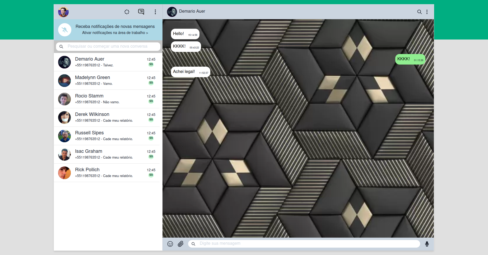

# WhatsApp! Web Clone with ReactJS

## Descrição

Projeto feito como desafio e treino de desenvolvimento front-end utilizando React JS.

# Tabela de conteúdos

- [Sobre](#Sobre)
- [Tabela de Conteudo](#tabela-de-conteudo)
- [Como usar](#como-usar)
- [Tecnologias](#tecnologias)
- [Imagens](#Imagens)

# Como Usar

Para executar a aplicação, basta clonar o repositório para sua máquina, entrar na pasta do projeto pelo terminal e instalar as dependências utilizando:

```
npm instal ou yarn add
```

Após a instalação, digite o comando:

```
npm start
```

# Tecnologias

Para esse projeto, as seguintes tecnologias foram utilizadas:

- Figma
- React
- ChakraUI
- Faker
- react-icons

# Imagens


